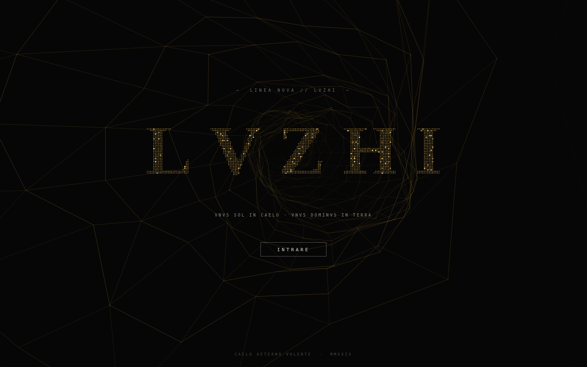
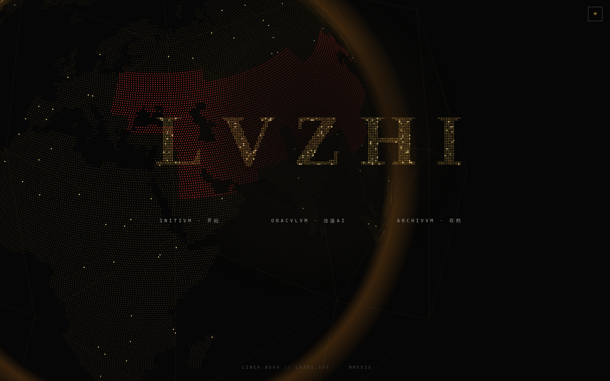
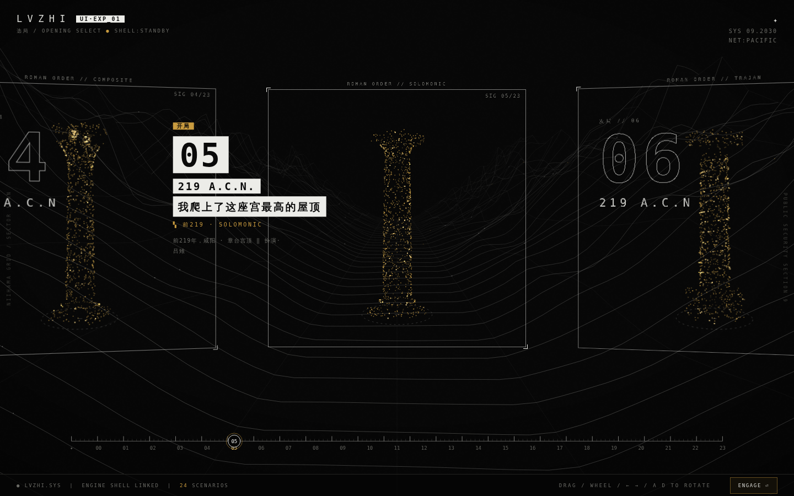
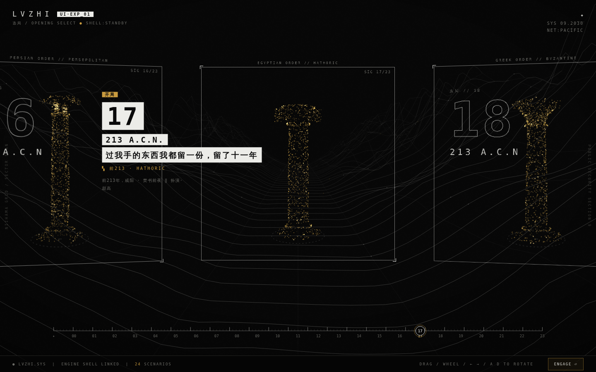
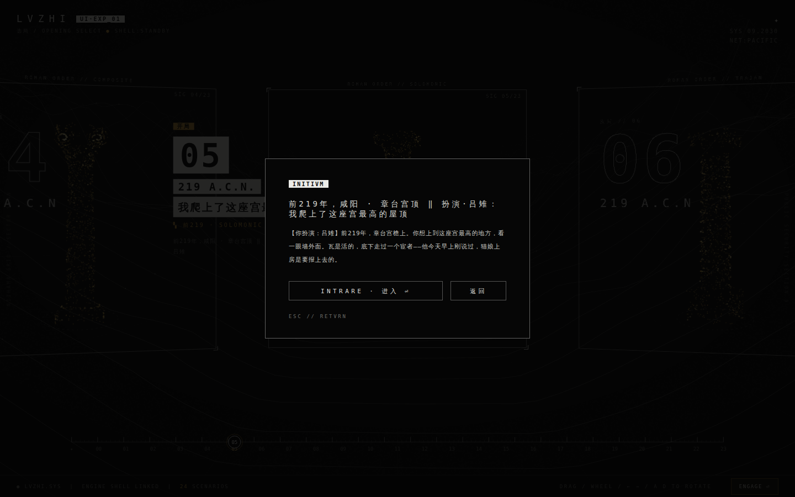
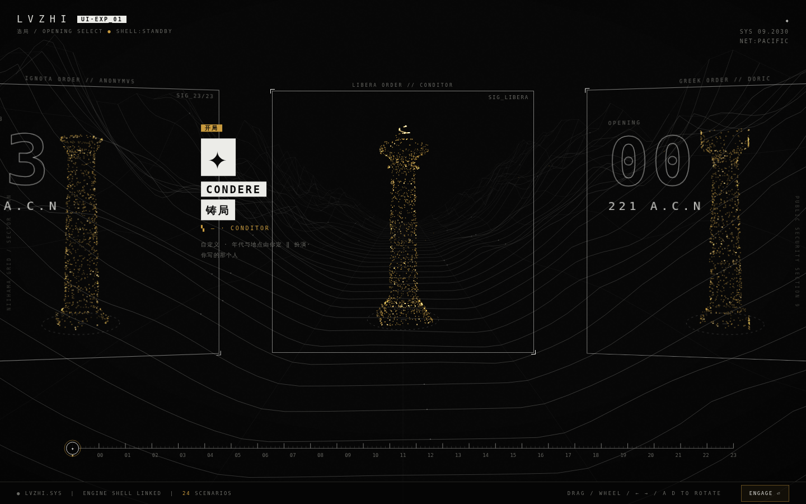
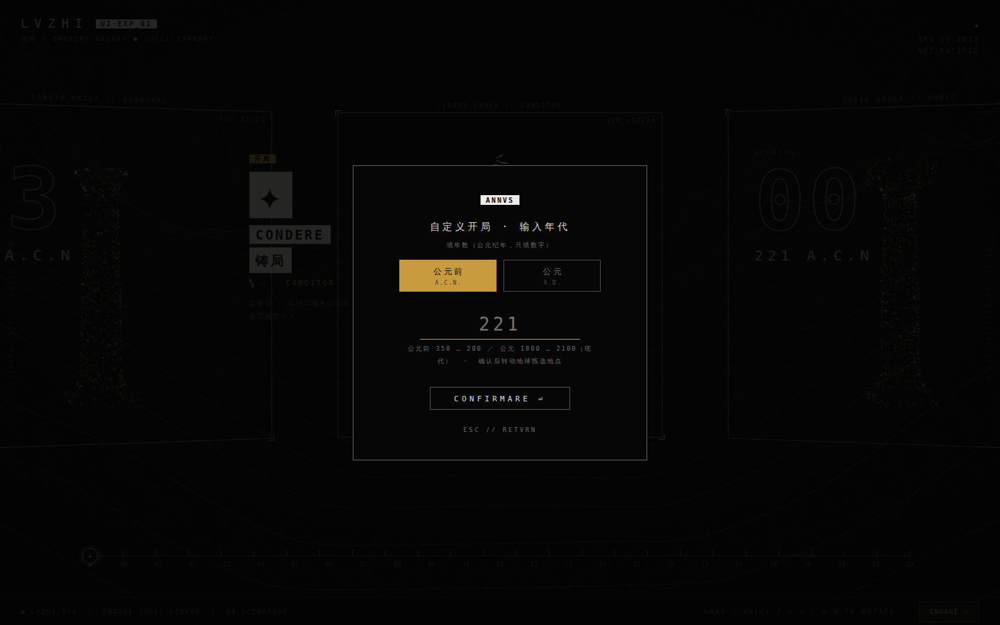
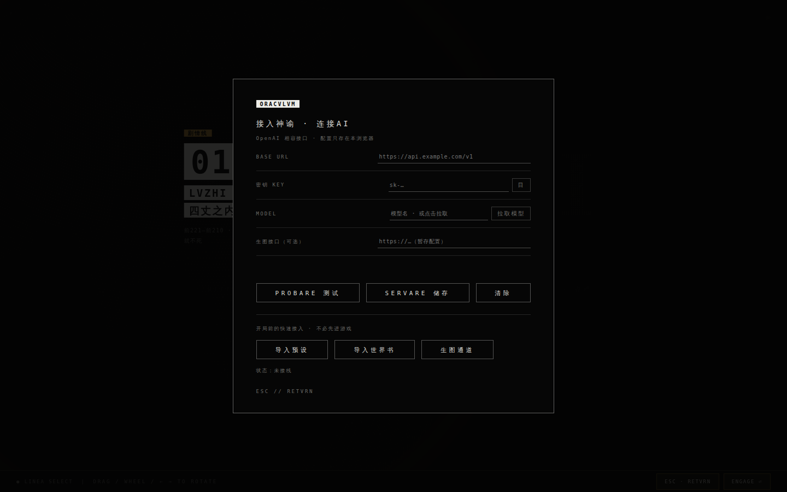
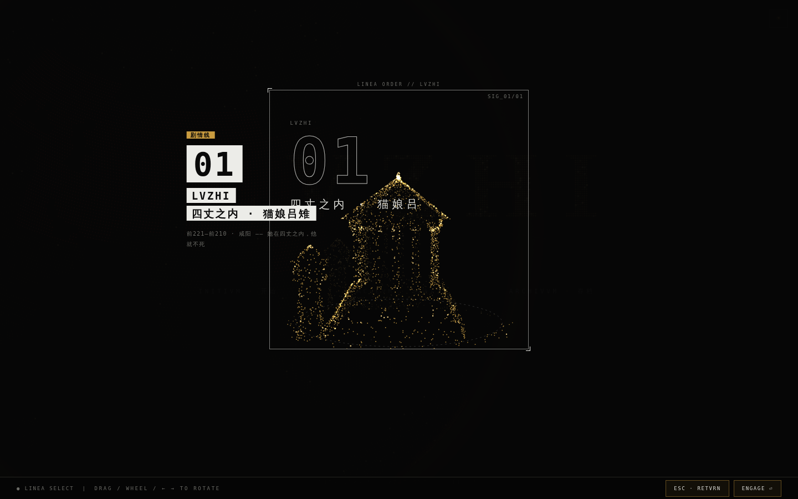

# 陆之纪 · 四丈之内

**LVZHI.SYS** —— 一部跑在浏览器里的叙事游戏。左手是可以无限写下去的文字剧本，右手是一座可以走进去的世界。

打开就能玩，不用装任何东西：**<https://lvzhi.vercel.app>**



---

## 这是什么

一个人类男子，一个猫娘，一条一丈二尺的金链。

前219年荆轲献图那一夜，她按住了他左股的伤口，皮肉在她指腹底下自己合上了。从那天起两个人拴在一起，规矩只有一条：

> **四丈之内。秦制四丈，十步。**
>
> 十步以内，伤口合上，病退，年岁停住。
> 出了十步，一步开始疼，两步就开始老。

他给她上了金链，起手三尺六寸，十一年放到一丈二尺。知道这个数目的十九个人，上链子那天全杀了。

这条规矩是双向的。他不老，她也不老；他不死，她也不死。**而这件事五十一年里两个人都不知道** —— 他没往那个方向想过一次，因为他这辈子没有一样东西是往外流的；她照镜子什么都看不出来，因为猫娘的脸本来就不老。

要对出这个错，得等到她七十岁，还在为第三碗饭在院子里骂人的那一天。



---

## 这个世界

猫娘和人一起过了一万年。她们不是人类女性的地方变种，也不是家猫的驯养后裔，在军籍、户籍、婚书、祭仪与城市工程里都是常态人口。

- 脚是猫脚，夜里看得见，跑得比人快 —— 可是正面挨一拳就倒下去
- 血跟人的血不能混用，混了就死。所以宫中另设女医，一律由猫娘充任
- 人类男子和猫娘生的，一律是猫娘
- **脸不老。**从二十岁到断气那天都是二十多岁人类女子的模样。寿数却和人一样，六十上下就到头
- 军中最看重的是探路：一天走一百二十里，翻得过营墙，夜里认得出旗色。军功簿上记在**杂役**那一栏，斩首的功不算她们的，赏减半

秦并天下那年，掖庭的名簿上写着一行字：

> 人一百零七口，猫娘十八头。

一句话里两个量词，写字那个人手都没停一下。第十八头叫吕雉，十九岁，脸生得太好，压不住毛。

---

## 二十四个开局

从前221年秦并六国，排到前170年腊月。每一局是一天，一天里发生一件回不了头的事。



| # | 年 | 扮演 | 地点 | 那一天 |
|---|---|---|---|---|
| 00 | 前221 | 吕雉 | 咸阳宫掖庭 · 录名 | 我被一车拖进了咸阳宫 |
| 01 | 前221 | 吕雉 | 掖庭 · 入宫第二十日 | 她们当着我的面说，猫娘用过的瓮要刷三遍 |
| 02 | 前220 | 吕雉 | 掖庭 · 尾语训 | 我用一条律条把教习送进了牢 |
| 03 | 前220 | 阿箸 | 掖庭 · 夜 | 只有我知道她报的律条是假的 |
| 04 | 前220 | 嬴政 | 咸阳北阪 · 新宫落成 | 有人把我的名号念错了一个字 |
| 05 | 前219 | 吕雉 | 章台宫顶 | 我爬上了这座宫最高的屋顶 |
| 06 | 前219 | 嬴政 | 咸阳宫正殿 · 图穷 | 荆轲的匕首出来了，我自己拔剑 |
| 07 | 前219 | 吕雉 | 咸阳宫 · 献图当夜 | 我一按上去，他的伤口自己合上了！？ |
| 08 | 前219 | 夏无且 | 太医署 · 三更 | 伤口自己合上了，我写了两份脉案 |
| 09 | 前218 | 蒙毅 | 郎中令署 | 上面要九十个人，我只查到八十七 |
| 10 | 前218 | 嬴政 | 咸阳宫 · 朝会 | 我当着满朝的人割自己一刀 |
| 11 | 前218 | 吕雉 | 隐宫地牢 | 我在牢里试，走多远骨头就接不回去 |
| 12 | 前217 | 嬴政 | 西殿 · 上链 | 知道这个数的十九个人，我今天全杀了 |
| 13 | 前216 | 阿疾 | 西殿 · 量距 | 我量出来的步数和上面要的对不上 |
| 14 | 前215 | 吕雉 | 西殿 · 三尺六寸 | 我的链子只有三尺六，她们想翻墙跑 |
| 15 | 前214 | 嬴政 | 上郡驰道 · 巡狩 | 巡狩的车上，每样东西都得伸手够得着 |
| 16 | 前214 | 吕雉 | 咸阳宫 · 巫蛊 | 我先夸了她，再把木人递到她手上 |
| 17 | 前213 | 赵高 | 咸阳 · 焚书前夜 | 过我手的东西我都留一份，留了十一年 |
| 18 | 前213 | 吕雉 | 咸阳城南 · 焚书当场 | 我把博士家九代的家谱混进了要烧的书 |
| 19 | 前212 | 吕雉 | 骊山下徙民场 | 出了宫谁见我都得跪，可蒙毅一来我就腿软 |
| 20 | 前211 | 芈萤 | 永巷 · 送饭 | 我送了三年饭，今天她问我姓什么 |
| 21 | 前211 | 吕雉 | 咸阳宫 · 他寝处，夜 | 为一盏灯吵了十年，今晚他又不肯灭 |
| 22 | 前210 | 嬴政 | 沙丘平台 · 第五次巡狩 | 先开口的就是输的，可我快死了 |
| 23 | 前170 | 吕雉 | 西殿 · 腊月，名录呈上 | 掖庭那本名录上，前221年录的十八头只剩一头没销籍 |

十二局是吕雉，六局是嬴政，剩下六局是别人 —— 缺了一只耳朵的阿箸、改过两个字的女医阿疾、太医夏无且、郎中令蒙毅、赵高，还有在永巷送了三年饭的芈萤。



选中一局按 ENGAGE，先给你看这一天的简介，再进去。



---

## 第二十五张牌：铸局

年代自己定，在地球上自己拣一处，人物自己写。



年代闸门吃公元前350—前200，以及公元1800—2100两段；确认之后转动地球拣地点，同一座城在不同年份是完全不同的地方。



---

## 你要盯着的东西

每一回合结尾附一张面板。它不是设定表，是同一个人在说话。

```
◆恩宠|68        ◆原形|74
◆心声|先开口的就是输的——这条是他自己立的。他立这条不是为了赢，
      是怕我把方才那半句说完
◆史笔|前211年，有坠星下东郡，至地为石。黔首或刻其石曰始皇帝死而地分
```

- **恩宠** 是他给你的绳子有多长
- **原形** 是你还剩多少猫。高了压不住毛，炸一次毛在掖庭是三下竹条
- **史笔** 是年代记的声音，干的汉文调，评价语一个都没有，和正文那个一人称故意撞在一起

在场的每个人另有一栏**眼色**：这个人此刻怎么看你的身份、脸、味道、岁数，是不是同类，有没有用。同一幕里几个人的眼色不许写成一个样。

> （男的看见我先把脸看完，看完就忘了规矩。所以过不去的那一边永远是女人这一边。）

---

## 接上你自己的 AI

任何 OpenAI 兼容接口都行。填 base URL、密钥和模型名，配置只存在你自己的浏览器里，不上传。



也可以在这里直接导入预设和世界书，不必先进游戏。

---

## 剧情线



---

## 参考书

游戏里那个世界不是临时编的。这一册是它的底稿。

**[《猫娘族群与文明》· Les Peuples félins et la civilisation](docs/books/peuples-felins-1900.pdf)**
巴黎比较人类学研究院年刊 · 一九〇〇年万国博览会特号 · 中法双语 · 87 页

> 科学若只量取一个身体，却不记录谁命令她站立、谁有权解释数字，便会把权力误写成自然。
> —— Lila Bérard，一九〇〇年六月七日会席发言

十六篇论考加九地区调查册，从身体构造、尾耳语言、发情与窝群契约，一路写到姓名权、军役、殖民展示与学派论战。书里明说猫娘没有对应人类白黄黑那样的面容分界 —— 所谓「种族」往往只是军队、殖民机关或谱牒家族的行政命名，把行政类别误作自然界限，是该院内部最激烈的争论之一。

游戏里那些数目 —— 一天一百二十里、军功簿的杂役栏、血不能混、脸不老而寿数照旧 —— 都是从这一册里出来的。

---

## 自己跑一份

```
git clone https://github.com/Ekibenya/Lvzhi
cd Lvzhi
python3 -m http.server 8080
```

然后开 `http://127.0.0.1:8080/core/vendor/three/build/chunks/9d717bc0/156a50943028.html`。

线上那份靠 `vercel.json` 把 `/` 重写到这个文件，所以直接开根路径就行。

## 目录

```
core/vendor/…/156a50943028.html   整个游戏，一个文件
core/three-bundle.min.js          三维引擎
core/res/data/idx/v1/             五十个城市索引包
core/res/data/st/v1/              十个三维资材包
core/res/icon/                    图标
docs/books/                       参考书
docs/img/                         截图
sw.js                             离线壳
manifest.webmanifest              可装成桌面应用
vercel.json                       路由与缓存
```

素材总量近 200 MB，`sw.js` 只预存「打得开」所需的那几个档，其余用过哪个存哪个。
